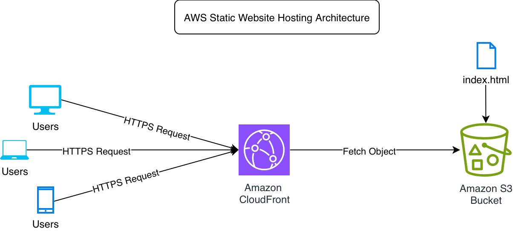

# AWS Static Website Hosting with S3 and CloudFront

## Project Overview

This project demonstrates how to host a static website on Amazon S3 and deliver it globally using Amazon CloudFront.

Key goals of the project:
- Deploy a static website using Amazon S3
- Deliver content globally through CloudFront CDN
- Secure S3 access using Origin Access Control
- Enable HTTPS access through CloudFront
- Demonstrate cache invalidation after updates

---

## Architecture

User → Amazon CloudFront (CDN) → Amazon S3

---

## Architecture Diagram

---

## Live Demo

CloudFront URL  
https://d2a4b3t8z01apv.cloudfront.net

---

## Services Used

- Amazon S3  
- Amazon CloudFront  
- Origin Access Control  
- S3 Bucket Policy  
- HTTPS via CloudFront

---

## What This Project Does

- Hosts a static website using Amazon S3  
- Uses CloudFront as a CDN for global content delivery  
- Secures S3 access using Origin Access Control  
- Implements HTTPS access through CloudFront  
- Demonstrates cache invalidation during updates  

---

## Deployment Steps

1. Created an S3 bucket configured for static website hosting  
2. Uploaded website files (index.html)  
3. Configured a CloudFront distribution  
4. Enabled Origin Access Control for secure S3 access  
5. Set default root object to `index.html`  
6. Performed cache invalidation after updates  

---

## Repository Contents

- index.html  
- architecture-diagram.png  
- README.md
